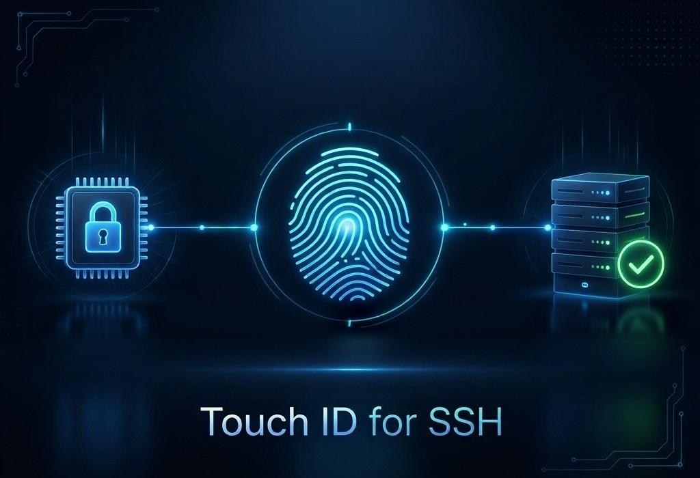
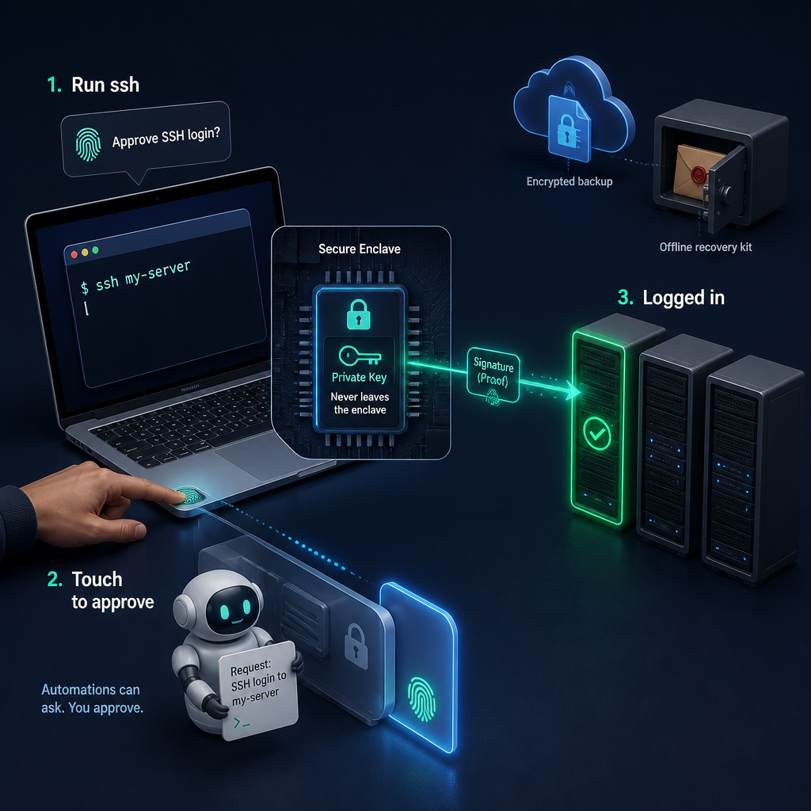

<p align="center">
  
</p>

# Touch ID SSH Agent for macOS

An SSH agent for macOS that keeps the key in the **Secure Enclave** and requires **Touch ID for every signature**. The `ssh` client stays the same, and the server only needs the public key in `authorized_keys`.

> Status: experimental (0.1.0). It does not replace an access recovery plan: always keep a second authorized key on the server (see [Recovery](#recovery)).

## What problem does it solve?

SSH keys are the right way to reach your servers: safer than passwords and just as easy to use. But a regular SSH key is a file in `~/.ssh`, and a file can be copied. If someone steals it, or you lose the computer, you have to create a new key and log in to every server twice: once to install the new key and once to remove the old one. With new vulnerabilities published every day and poisoned development packages that harvest credentials from developer machines, a stolen key is a real risk, not a theoretical one.

touchid-ssh-agent keeps the convenience of SSH keys and gets rid of the file:

- **Nothing to steal.** The key is created inside the Mac's Secure Enclave and never leaves it. Malware or a compromised package that copies `~/.ssh` finds nothing it can use.
- **Touch ID for every SSH login.** Each signature needs your fingerprint, with no "remember me" window. Even an unlocked Mac is not enough without your finger.
- **AI agents and scripts can ask, but only you approve.** The prompt shows who asked (`ssh ← zsh ← claude`) and, when the server supports it, where to.
- **One command per server.** `authorize` installs both your Touch ID key and your emergency key, checks that the Touch ID login works, and records the server.
- **An inventory of your access.** Every server you authorize is listed, so you always know where your keys are installed.
- **An encrypted backup in your cloud.** After every `authorize`, an encrypted copy of the inventory goes to a cloud-synced folder of your choice. Only your emergency kit can open it.
- **An emergency kit for the day the Mac is gone.** A passphrase-protected key that you keep outside the Mac, already installed on every server, with the steps to get back in from any computer.
- **Audits.** `audit` checks that every server in the inventory still has both keys.
- **Standard OpenSSH, nothing to install on servers.** It works with the `ssh` and `git` you already use; servers only need public keys in `authorized_keys`.
- **No account, no service, no telemetry.** Everything runs on your Mac, and the code is open source.

### Coming next

Here is what is on the way. Star or watch the repository to follow along, and share your ideas in [Discussions](https://github.com/allankz/touchid-ssh-agent/discussions/categories/ideas).

- **Temporary access for AI agents.** One Touch ID before you step away issues a short-lived, tightly scoped SSH certificate, so an agent can keep working overnight or while you are away from the Mac. The server rejects it once it expires, and your main key keeps asking for Touch ID. ([design](docs/phase-2-temporary-credentials.md))
- **Automated recovery.** From a new Mac, one command opens the inventory with the emergency kit, logs in to every server, installs the new Touch ID key and removes the lost Mac's key.

## How it works

<p align="center">
  
</p>

```text
ssh (or git, or an AI agent running ssh)
   │  Unix socket ~/.touchid-ssh-agent/agent.sock (ssh-agent protocol)
   ▼
touchid-ssh-agent  ──►  Touch ID (LocalAuthentication, fresh context per request)
   │
   ▼
Secure Enclave: signs; the private key never leaves the chip
```

- The key is ECDSA P-256 (`ecdsa-sha2-nistp256`), generated **inside** the Secure Enclave.
- `~/.touchid-ssh-agent/identity.se` only holds a blob encrypted by the Secure Enclave. It does not work on any other Mac and cannot be turned into a private key.
- The Touch ID requirement is sealed into **the blob itself** by the Secure Enclave. Changing the file or the program does not remove it.
- Every signature request creates a fresh authentication context. There is no reuse, no silent mode and no "remember for N minutes".
- If nobody approves within 60 s, the request is denied.

### What the Touch ID prompt shows

macOS shows something like:

> “touchid-ssh-agent” is trying to **log in over SSH as admin to server.example, requested by ssh ← zsh ← claude**.

- **Remote user**: what `ssh` put in the authentication request.
- **Server**: when the server supports `publickey-hostbound` (OpenSSH ≥ 8.9), the signature is bound to the server's host key, and the agent looks up the matching name in your `~/.ssh/known_hosts`. Without that binding the prompt names no server, because the protocol gives no way to confirm the destination.
- **Requester**: the chain of local processes that opened the socket (`ssh ← zsh ← Terminal`). It is a hint, not proof.
- SSH-signed git commits show up as "sign a git commit or tag".

The words around the reason ("is trying to") come from macOS in the system language.

## Requirements

- A Mac with Touch ID (Apple Silicon or T2) running macOS 13 or later.
- Swift 5.10 or later. The Command Line Tools are enough: `xcode-select --install`.
- [age](https://age-encryption.org) for the encrypted inventory backup: `brew install age`.

## Installation

```bash
make install                        # builds and copies to ~/.local/bin
touchid-ssh-agent setup             # Touch ID key, cloud backup folder, emergency kit
touchid-ssh-agent install           # registers the LaunchAgent (starts with your session)
touchid-ssh-agent authorize user@server -p 22
touchid-ssh-agent status
```

`authorize` connects **with the access that already works** (a password or another key), adds both the Touch ID key and the emergency key to the server's `authorized_keys`, checks that the Touch ID key logs in, and records the server in the inventory. If your current access needs extra ssh options, pass them after `--`, for example `-- -i ~/.ssh/old_key`. If the server has a `Host` alias in your `~/.ssh/config`, authorize the alias rather than its IP, so its port and options apply. ssh may ask for the server's password or to confirm its host key on this first connection; once the keys are installed, logins only need Touch ID.

Generate the `~/.ssh/config` block. The command only prints it and changes no file:

```bash
touchid-ssh-agent config my-server --host server.example --user admin --port 22
```

```sshconfig
Host my-server
  HostName server.example
  User admin
  Port 22
  IdentityAgent ~/.touchid-ssh-agent/agent.sock
  IdentityFile ~/.touchid-ssh-agent/id_ecdsa_se.pub
  IdentitiesOnly yes
  ForwardAgent no
```

`IdentityFile` points to the **public** key on purpose. With `IdentitiesOnly yes`, `ssh` only uses the keys listed there. When it finds the public key, it asks the agent for the signature. Without that line, `ssh` would never offer the Secure Enclave key.

From then on, `ssh my-server` asks for Touch ID.

### Signing git commits

git signs with `ssh-keygen -Y sign`, which looks for the agent in `SSH_AUTH_SOCK`. It does not read `IdentityAgent` from `ssh_config`. To use Touch ID for commits without replacing the system's default agent, point git to a small wrapper:

```bash
printf '#!/bin/sh\nSSH_AUTH_SOCK="$HOME/.touchid-ssh-agent/agent.sock" exec /usr/bin/ssh-keygen "$@"\n' > ~/.local/bin/ssh-keygen-touchid
chmod +x ~/.local/bin/ssh-keygen-touchid
git config --global gpg.format ssh
git config --global gpg.ssh.program ~/.local/bin/ssh-keygen-touchid
git config --global user.signingkey ~/.touchid-ssh-agent/id_ecdsa_se.pub
git config --global commit.gpgsign true
```

## Upgrading

```bash
git pull
make install
launchctl kickstart -k gui/$(id -u)/local.touchid-ssh-agent
```

Upgrades are additive. A new version never undoes what you have already set up:

- **Your Touch ID key keeps working.** The Secure Enclave blob is not tied to a particular build of the binary.
- **Keys already installed on your servers stay valid.** No server needs to be touched after an upgrade.
- **Your emergency kit, inventory and backup folder keep working.** File formats only gain optional fields, so every later version reads what earlier versions wrote.
- **New features arrive as new commands or options.** If a change ever needs an action from you, it will be an explicit command you choose to run, never a side effect of upgrading.

## Emergency kit and inventory

The Touch ID key cannot leave this Mac. If the Mac is lost, stolen or broken, or if your fingerprints change under the `current-set` policy, that key is gone. The emergency kit is how you get back in.

- **The kit is one file**: an Ed25519 SSH key **encrypted with your emergency passphrase**, followed by plain-text recovery instructions. `ssh -i` and `age -i` accept the file as it is.
- **The file is useless without the passphrase.** The key is encrypted in OpenSSH's own format with a deliberately slow key derivation (bcrypt, 200 rounds), and the generated passphrase has about 119 bits. So the kit does not need a password manager: a USB drive, an email to yourself or a printout work too, as long as **the passphrase is kept somewhere else**. The instructions part names fingerprints and your backup folder, but no secret.
- **`setup` shows a random passphrase once** and asks you to retype it, then reveals the kit in Finder. Once you have stored the kit outside this Mac and typed `SAVED`, the copy on the Mac is erased and only the public key stays.
- **Every `authorize` installs both keys.** The emergency key is never left out.
- **The inventory** (`~/.touchid-ssh-agent/inventory.json`) lists every authorized server. A copy, `inventory.age`, goes to the backup folder you chose, ideally one synced to the cloud. It is encrypted with age to the emergency key, so this Mac can update it but only the kit can read it. If the Mac is stolen, that copy is how you find your servers again.
- **`audit`** logs in to every server in the inventory (one Touch ID each) and checks that both keys are still there.

Already have an emergency key, for example one kept in your password manager? Import its public half with `touchid-ssh-agent recovery import key.pub` (ed25519 or rsa). Change the backup folder at any time with `touchid-ssh-agent set backup-path DIR`.

### If the Mac is gone

From any computer with OpenSSH and age:

```bash
chmod 600 emergency-kit.txt
age -d -i emergency-kit.txt inventory.age     # server list; asks for the passphrase
ssh -i emergency-kit.txt -p PORT USER@HOST    # asks for the passphrase
```

Then remove the lost Mac's login key from each server (`ssh-keygen -lf ~/.ssh/authorized_keys` shows each line's fingerprint), set up the new Mac, `authorize` every server again, and retire the emergency key you used. The same steps are written inside the kit.

## Commands

| Command | What it does |
| --- | --- |
| `setup [--biometry current-set\|any] [--comment T]` | Guided setup: Touch ID key, backup folder, emergency kit. |
| `authorize [user@]host [-p P] [-F FILE] [--alias A] [-- SSH_ARGS]` | Installs both keys, checks the Touch ID login, updates the inventory and its backup. |
| `audit [ALIAS...]` / `inventory` | Checks or lists the servers in the inventory. |
| `set backup-path DIR\|none` | Sets or clears the backup folder for `inventory.age`. |
| `recovery create [--replace] [--own-passphrase]` | Creates a new emergency kit. |
| `recovery import FILE.pub [--replace]` / `recovery pubkey` | Uses an existing emergency key / prints the emergency public key. |
| `create [--comment T] [--biometry current-set\|any]` | Creates only the Touch ID key. Refuses if one already exists. |
| `pubkey` / `fingerprint` | Prints the public key or its SHA256 fingerprint. |
| `status` | Secure Enclave, Touch ID (including password lockout), identity, agent, LaunchAgent, emergency key, backup folder and FileVault. |
| `config ALIAS --host H [--user U] [--port P]` | Prints the `ssh_config` block. |
| `agent` | Runs the agent in the foreground (useful for debugging). |
| `install [--force]` / `uninstall` | Registers or removes the `local.touchid-ssh-agent` LaunchAgent. |
| `delete` | Deletes the identity irreversibly, after you type `DELETE`. |

By default everything lives in `~/.touchid-ssh-agent/`. Set `TOUCHID_SSH_AGENT_DIR` to use another directory. Touch ID must be approved within 60 s; to change that, set `TOUCHID_SSH_AGENT_PROMPT_TIMEOUT` (in seconds) in the agent's environment.

### Biometry policies

- `current-set` (default): only the fingerprints enrolled today. **Adding or removing a fingerprint invalidates the key forever.** This is the strictest option.
- `any`: any fingerprint enrolled now or later. The key does not need to be recreated when fingerprints change.

Neither accepts the Mac password as a fallback for Touch ID.

## AI agents and automation

An AI agent (or script) running on your Mac **can request** a signature through the socket, but it **cannot approve** it: every request opens Touch ID for you.

- It does not read the private key, and it cannot. The key does not exist outside the Secure Enclave.
- If you deny or ignore the prompt, authentication fails.
- The prompt shows who asked (`ssh ← zsh ← claude`) and, when possible, where to.
- Agents running off the Mac (cloud, a container without the socket mounted, another machine) cannot reach the agent.

The agent only accepts connections from your own user (UID checked on the socket). The socket has mode `0600`, inside a `0700` directory.

## Known limitations

- Someone who already controls your user session can trigger requests and try to trick you into approving. Read the prompt before touching the sensor.
- Without `publickey-hostbound`, the agent cannot know the destination. The name shown comes from `known_hosts`, not from a check of its own.
- The process chain can be stale if the process exited and its PID was reused. That is why it only informs and never decides.
- One identity per Mac in this version.
- `ForwardAgent` re-exposes the agent to the remote server. Keep it off, even with Touch ID.

See [`SECURITY.md`](SECURITY.md) for the threat model and how to report a vulnerability.

## Recovery

The Touch ID key is tied to **this** Mac and, with the `current-set` policy, to the current fingerprints. It is gone if you change Macs, if the Mac fails, if the fingerprints change, or if you run `delete`. So:

1. Keep the **emergency kit** outside the Mac and make sure every server has the emergency key (`audit`). See [Emergency kit and inventory](#emergency-kit-and-inventory).
2. Test the kit from another computer now and then. A kit nobody has tried is a hope, not a plan.
3. To move to a new Mac: run `setup` on the new Mac, `authorize` every server from it, test the login in a second session, and only then remove the old Mac's line from `authorized_keys`.

## Roadmap

- **Phase 1.5: emergency kit and inventory.** Done; design notes in [`docs/phase-1.5-emergency-kit.md`](docs/phase-1.5-emergency-kit.md).
- **Automated recovery.** From a new Mac, a command that opens the inventory with the emergency kit, logs in to every server, installs the new Touch ID key and removes the lost Mac's key.
- **Phase 2: temporary credentials for agents (overnight use).** One Touch ID before bed issues an SSH certificate valid for a few hours, with a restricted scope, signed by a CA kept in the Secure Enclave. The login key keeps asking for Touch ID on every use. Design in [`docs/phase-2-temporary-credentials.md`](docs/phase-2-temporary-credentials.md). Not implemented yet.

## Development

```bash
make test          # wire format, protocol, Secure Enclave and agent tests (OpenSSH as the oracle)
make test-docker   # adds a real SSH login against an sshd container
make test-touchid  # interactive: approve, deny and time out real Touch ID prompts, with the agent under launchd
```

See [`CONTRIBUTING.md`](CONTRIBUTING.md) for the ground rules, requirements and how to submit changes.

The interactive commands (`setup`, `recovery create`) are driven through a real pseudo-terminal with `expect`. The tests create Secure Enclave keys **without** Touch ID, only in temporary directories. That API is `@_spi(Testing)`, refuses the default directory and is not reachable from the CLI. The Mac must stay unlocked while the tests run.

Layout:

- `Sources/TouchIDSSHCore/`: SSH wire format, agent protocol, identity, signer, server and LaunchAgent.
- `Sources/touchid-ssh-agent/`: CLI.
- `Tests/SelfTest/`: test suite (an executable, because XCTest does not ship with the Command Line Tools).
- `Tests/e2e/`: `sshd` image used by the end-to-end test.
- `docs/`: design notes for each phase.

### Why a file and not the Keychain

A Secure Enclave key stored in the Keychain is tied to the app's code signature and requires entitlements from an Apple Developer Team. With ad hoc signing, every rebuild would lose access to the key. CryptoKit's `dataRepresentation` blob has the same hardware guarantee (only this Mac's Secure Enclave can open it) and survives binary updates.

## License

MIT. See [`LICENSE`](LICENSE).
